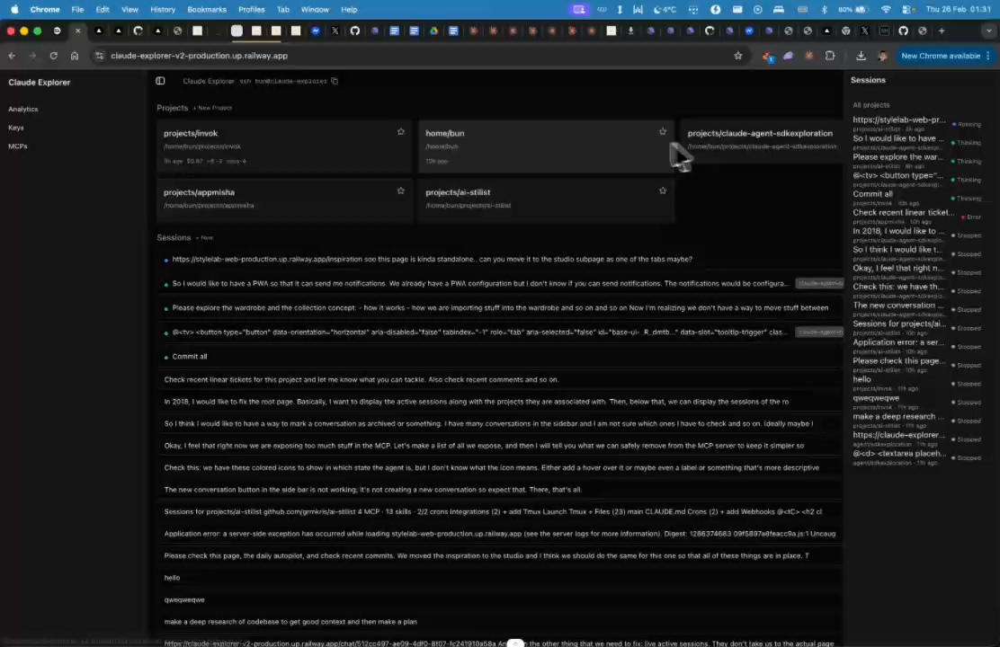
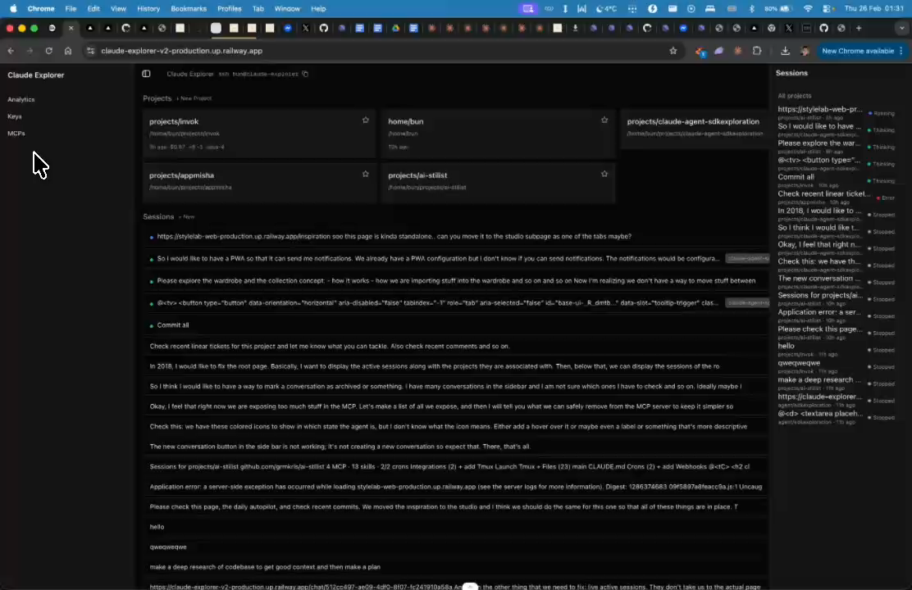

# Sidebar Navigation Items

## Summary
Add emails, webhooks, cron jobs to left sidebar. Currently has analytics, keys — wants the full list displayed.

## What's Being Shown
Left sidebar on root/home page needs additional navigation items

## Tasks
- [ ] Add emails section to sidebar
- [ ] Add webhooks section to sidebar
- [ ] Add cron jobs section to sidebar
- [ ] Already has: analytics, keys — ensure full list is shown

## Screenshots
- 
- 

## Transcript Excerpt
```
[0:10.9] So right now I am on the route of the app.
[0:15.4] On the left side bar I want to display emails, web hooks,
[0:22.8] Chrome jobs will last them.
[0:28.2] So we have analytics keys and somesipiss and what I just described.
```

## Timestamps
- Start: 10.9s (0:10.9)
- End: 30.9s (0:30.9)

## Implementation Plan

### Current State (main branch)
`GLOBAL_NAV` in `project-sidebar.tsx` has 3 items: Analytics, Keys, MCPs. Global nav only shows on root view (not inside project view).

### Target State (already on `feat/agent-tab-bar` branch)
`GLOBAL_NAV` expanded to 6 items: Analytics, Keys, MCPs, Email, Webhooks, Crons. Global nav always visible (both root and project views). Root view shows "Recent sessions" panel below global nav.

### Route Pages Already Exist
- `/app/email/page.tsx`
- `/app/webhooks/page.tsx`
- `/app/crons/page.tsx`

### Steps (single file change)

**File:** `components/project-sidebar.tsx`

1. **Add imports** — `SessionsPanel` from `@/components/sessions-panel`, `SidebarGroupLabel` from `@/components/ui/sidebar`
2. **Expand GLOBAL_NAV** — add 3 entries:
   ```ts
   { href: "/email", label: "Email", tooltip: "Email Config" },
   { href: "/webhooks", label: "Webhooks", tooltip: "Webhooks" },
   { href: "/crons", label: "Crons", tooltip: "Cron Jobs" },
   ```
3. **Restructure SidebarContent** — move global nav out of conditional so it always renders. Then:
   - Project view: render `ProjectExplorerPanel`
   - Root view: render `SidebarGroupLabel("Recent sessions")` + `SessionsPanel showProjectLabel`

### Prerequisites
- Verify `SessionsPanel` exists on main (it's on the feature branch)

### Complexity: Low
