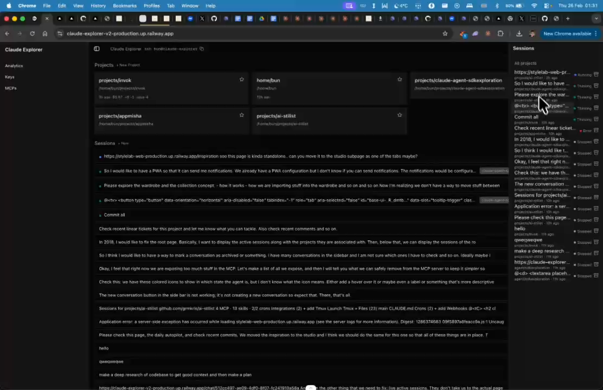

# Sessions Panel - Collapse by Default

## Summary
Sessions panel on the right looks good but should be collapsed by default.

## What's Being Shown
Sessions panel on the right side of the home page

## Tasks
- [ ] Sessions panel should be collapsed by default
- [ ] Keep expand/collapse toggle

## Screenshots
- 

## Transcript Excerpt
```
[0:32.8] Then on the right where we have the sessions, looks good.
[0:42.8] It could be collapsed maybe by default.
```

## Timestamps
- Start: 32.8s (0:32.8)
- End: 45.0s (0:45.0)

## Implementation Plan

### Current Architecture
| Layer | File | Role |
|-------|------|------|
| Context Provider | `components/ui/right-sidebar-context.tsx` | Manages open/collapsed state, cookie persistence, Cmd+E shortcut |
| Layout (server) | `app/layout.tsx` | Reads `right_sidebar_state` cookie, passes `defaultOpen` |
| Sidebar shell | `components/right-sidebar.tsx` | Fixed panel with offcanvas collapse animation |
| Toggle button | `components/ui/right-sidebar-trigger.tsx` | Calls `toggleSidebar()` |

### Root Cause
Code already defaults to collapsed (`defaultOpen = false` in context). But `layout.tsx` reads a persisted cookie that overrides it to `true` for returning users.

### Recommended Fix (Approach C)

**File:** `app/layout.tsx`
1. Remove lines 55-56 (the `rightSidebarOpen` cookie read variable)
2. Change `<RightSidebarProvider defaultOpen={rightSidebarOpen}>` to `<RightSidebarProvider>`

The provider's default parameter is already `false`. Cookie write-side is kept for future use.

### No Changes Needed
- `right-sidebar-context.tsx` — already defaults to `false`
- `right-sidebar.tsx` — collapse/expand rendering works
- `right-sidebar-trigger.tsx` — toggle button works
- `sessions-panel.tsx` — independent of collapse state

### Complexity: Low (one file, two deletions)
