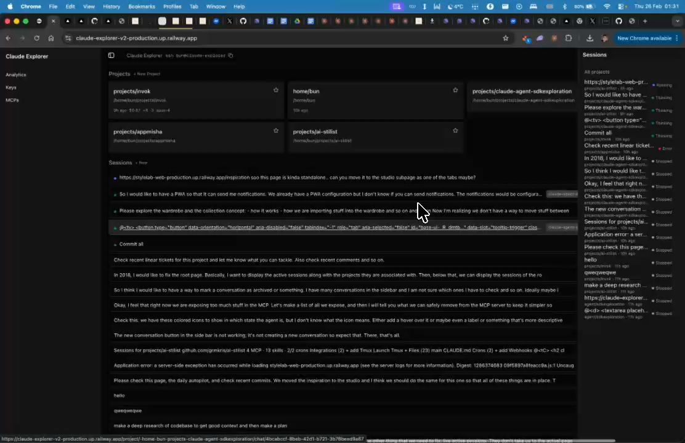

# Middle Content Area - No Horizontal Scroll

## Summary
Middle area currently scrolls left/right. Should be bounded inside its container — no horizontal overflow.

## What's Being Shown
Main content area has unwanted horizontal scrolling

## Tasks
- [ ] Remove horizontal scroll from middle content area
- [ ] Content should be bounded inside its container (overflow-x: hidden or proper width constraints)

## Screenshots
- 

## Transcript Excerpt
```
[0:47.9] Then the middle it should not scroll like right now the middle is scrollable to the left and right.
[0:55.2] It should be bounded inside.
```

## Timestamps
- Start: 47.9s (0:47.9)
- End: 57.5s (0:57.5)

## Implementation Plan

### Root Cause
`SidebarInset` (`<main>`) has `flex w-full flex-1 flex-col` but **no `min-w-0`**. In flexbox, children have implicit `min-width: auto` — they won't shrink below content size. Wide content (code blocks, `<pre>`) forces the `SidebarInset` beyond its flex allocation, causing horizontal scroll.

### Layout Hierarchy
```
SidebarProvider (flex min-h-svh w-full)
  ProjectSidebar (left, fixed)
  SidebarInset (<main> flex w-full flex-1 flex-col) ← MISSING min-w-0
    header (flex h-10 shrink-0)
    AgentTabBar (flex h-9 shrink-0, overflow-x-auto)
    div.overflow-hidden (flex flex-1 flex-col) ← already has overflow-hidden
      {children}
  RightSidebar (right, fixed)
```

### Fix (single line)

**File:** `components/ui/sidebar.tsx` line 311
Add `min-w-0` to `SidebarInset` className:
```
"... relative flex min-w-0 w-full flex-1 flex-col"
```

The child `overflow-hidden` wrapper in `layout.tsx` line 85 then properly clips content.

### Safety Net
If step 1 alone isn't sufficient, also add `overflow-x-hidden` on `SidebarInset` itself.

### What NOT to Change
- `AgentTabBar` `overflow-x-auto` — intentional horizontal scroll for tabs
- Tool renderer `<pre>` blocks — already have `overflow-auto` within their containers
- `globals.css` — no CSS overrides needed

### Complexity: Low (one class addition)
