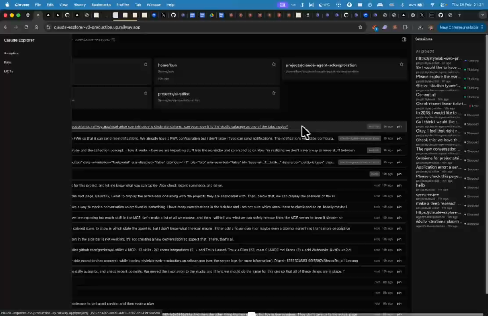
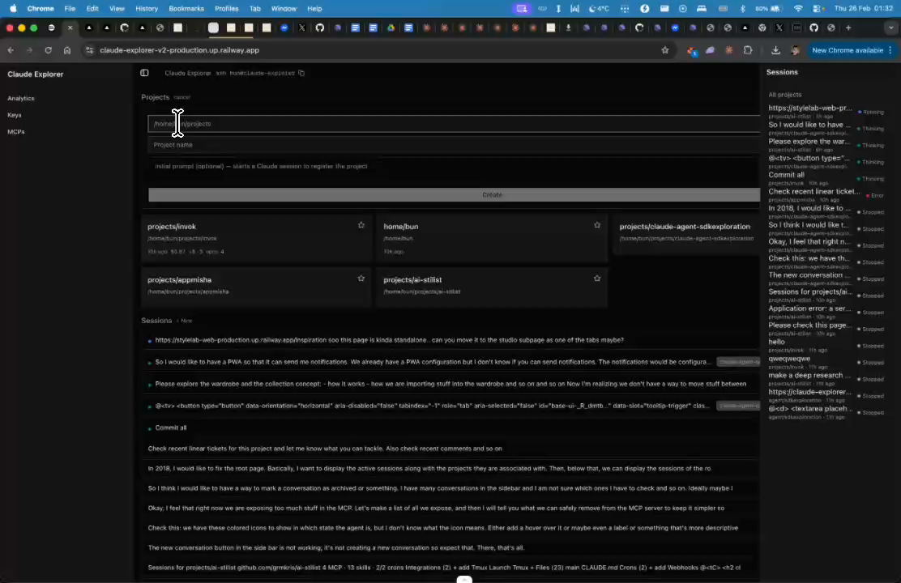

# Display Project Name Instead of Placeholder

## Summary
Replace 'Home' placeholder with actual project name. Auto-create CLAUDE.md in project directory. Initial prompt should allow specifying MCPs and skills to include.

## What's Being Shown
Project header shows generic 'Home' placeholder instead of actual project name

## Tasks
- [ ] Display actual project name instead of 'Home' placeholder
- [ ] Auto-create CLAUDE.md in the project directory when project is created
- [ ] Allow specifying MCPs and skills during project setup

## Screenshots
- 
- 

## Transcript Excerpt
```
[1:00.5] I want to display which project I chose.
[1:28.1] I don't want to have this placeholder home,
[1:30.7] I want to have a project name and I want to create it in the project directory.
[1:37.5] Automatically.
```

## Timestamps
- Start: 60.5s (1:00.5)
- End: 98.1s (1:38.1)

## Implementation Plan

### Analysis
"Home" is actually `Home01Icon` used for the Overview tab. The real issue: breadcrumb derives name from `project.path.split("/").at(-1)` or `slug.replace(/-/g, " ")` — no proper `name` field on the project model.

### Part 1: Add `name` field to Project model
- **`lib/schemas.ts`** — add `name: z.string().optional()` to `ProjectSchema`
- **`lib/claude-fs.ts`** — in `listProjects()`, derive `name` from last path segment as default

### Part 2: Display project name
- **`components/app-breadcrumb.tsx`** — use `project?.name ?? project?.path.split("/").at(-1) ?? slug.replace(/-/g, " ")`
- **`components/project-explorer-panel.tsx`** — add project name label in `SidebarHeader` above tabs
- **`app/page.tsx`** — use `project.name` in project cards

### Part 3: Auto-create CLAUDE.md
- **`lib/claude-fs.ts`** — add `initProjectClaudeMd(projectPath, projectName)` helper
- **`lib/procedures.ts`** — call it in `createProjectProc` after directory creation

### Part 4: MCP/skills during setup (see also Feature 05)
- **`lib/procedures.ts`** — extend `createProjectProc` input to accept `mcpServers[]` and `skills[]`
- Install MCPs via `runClaudeCli(["mcp", "add-json", ...])` per server
- Install skills via `npx -y skills add` per skill

### Implementation Order
1. `schemas.ts` — add `name` (1 line)
2. `claude-fs.ts` — populate `name` + add `initProjectClaudeMd()`
3. `procedures.ts` — extend `createProjectProc`
4. `app-breadcrumb.tsx` — use `project.name`
5. `project-explorer-panel.tsx` — show name in sidebar header
6. `app/page.tsx` — use `project.name` in cards

### Complexity: Low-Medium
