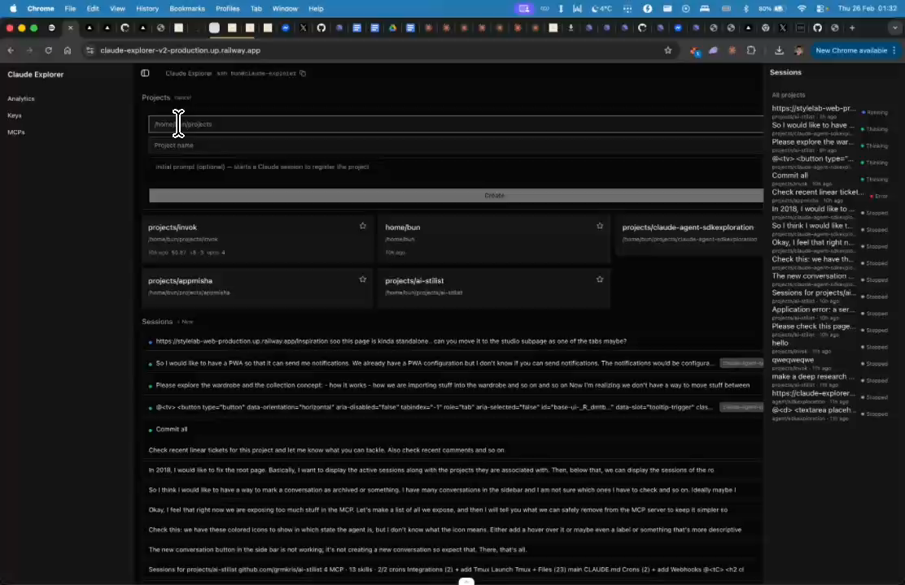

# Project Creation - MCPs, Skills & Templates

## Summary
When creating a project, allow specifying which MCPs and skills to include. Possibly offer templates for common setups.

## What's Being Shown
Project creation flow needs more configuration options

## Tasks
- [ ] Add initial prompt field to project creation
- [ ] Add MCP selection to project creation
- [ ] Add skills selection to project creation
- [ ] Consider adding templates for common project setups

## Screenshots
- 
- 

## Transcript Excerpt
```
[1:41.5] The initial prompt and actually here we could also specify which MCPs and skills you want to include.
[1:55.3] And if maybe we could have some templates or something.
```

## Timestamps
- Start: 101.5s (1:41.5)
- End: 118.4s (1:58.4)

## Implementation Plan

### Current State
- `NewProjectForm` in `app/page.tsx` has 3 fields: parent dir, name, initial prompt
- `MCP_CATALOG` in `lib/mcp-catalog.ts` — 12 hardcoded MCP entries
- `SUGGESTED_SKILLS` in same file — 10 popular skills from skills.sh
- No templates exist anywhere in the codebase

### Step 1: Define templates in `lib/mcp-catalog.ts`
```ts
export interface ProjectTemplate {
  id: string; name: string; description: string; emoji: string;
  mcpIds: string[]; skillIds: string[];
  initialPrompt?: string; claudeMdSnippet?: string;
}
```
Example templates: "Next.js Fullstack", "API Service", "AI Agent", "Blank Project"

### Step 2: Extend `createProjectProc` in `lib/procedures.ts`
- Add `mcps[]` and `skills[]` to input schema
- After dir creation: install MCPs via `runClaudeCli(["mcp", "add-json", ...])`, skills via `npx -y skills add`
- Then run initial prompt (existing behavior)

### Step 3: Expand `NewProjectForm` in `app/page.tsx`
1. **Template cards** — horizontal row, clicking pre-fills MCPs/skills/prompt
2. **MCP picker** — collapsible, checkboxes from `MCP_CATALOG`, env var inputs for checked MCPs with `envTemplate`
3. **Skill picker** — collapsible, checkboxes from `SUGGESTED_SKILLS`
4. **Initial prompt** — existing textarea, pre-filled from template

### State additions in NewProjectForm
```ts
const [selectedTemplate, setSelectedTemplate] = useState<string | null>(null);
const [selectedMcps, setSelectedMcps] = useState<string[]>([]);
const [selectedSkills, setSelectedSkills] = useState<string[]>([]);
const [mcpEnvValues, setMcpEnvValues] = useState<Record<string, Record<string, string>>>({});
```

### File Changes
| File | Change |
|------|--------|
| `lib/mcp-catalog.ts` | Add `ProjectTemplate` + `PROJECT_TEMPLATES` |
| `lib/procedures.ts` | Extend `createProjectProc` input + MCP/skill install |
| `app/page.tsx` | Template cards, MCP/skill pickers in `NewProjectForm` |

### Complexity: Medium
