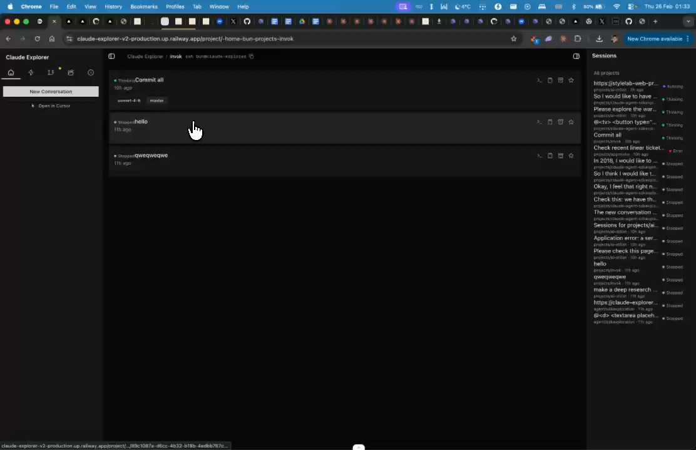
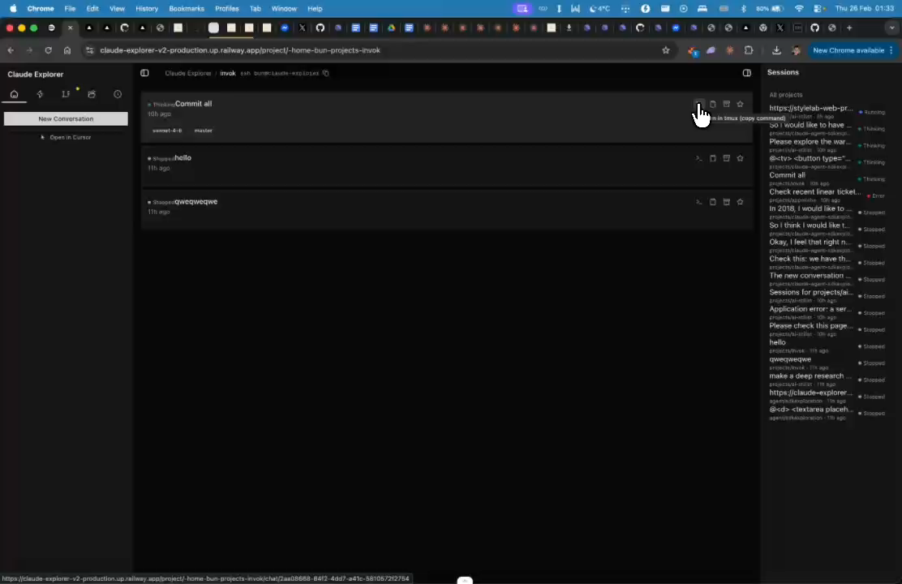
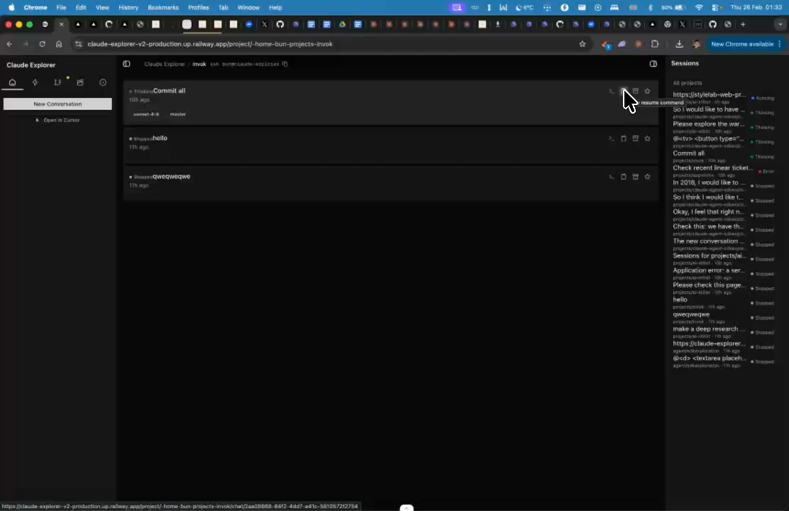

# Session Thread Actions - Copy/Resume/Tmux

## Summary
Session threads need a popover with actions: copy command, resume session, open in tmux. Multiple combinations of actions (CC tmux, etc). Popover should appear on hover/click.

## What's Being Shown
Session/thread items need actionable popover with multiple options

## Tasks
- [ ] Add popover/dropdown on session thread items
- [ ] Include 'Copy command' action
- [ ] Include 'Resume session' action
- [ ] Include 'Open in tmux' action
- [ ] Include 'CC tmux' (Claude Code in tmux) option
- [ ] Fix: popover takes too long to appear (latency issue)

## Screenshots
- 
- 
- 

## Transcript Excerpt
```
[2:07.8] Now let's go inside the project.
[2:11.3] So once I'm inside the project I want to see.
[2:21.4] Like the icons that are on the sessions on the threads,
[2:26.5] this should have a pop link.
[2:29.8] Oh, how it effect.
[2:32.2] It's there but it takes some time to.
[2:46.5] So.
[2:55.0] Once you click the copy command.
[3:01.8] We should.
[3:05.7] Like we either.
[3:09.7] I have a copy resume.
[3:13.8] Open in teamx but maybe we want to have through the edge.
[3:17.3] This is actually what we should do.
[3:21.0] Like we have a pop-up over and then we can do.
[3:24.8] CC teamx.
[3:26.6] This is actually just.
[3:28.3] There are many combinations basically.
```

## Timestamps
- Start: 127.8s (2:07.8)
- End: 210.3s (3:30.3)

## Implementation Plan

### Current State — 3 locations with session actions
| Location | File | Current Actions |
|----------|------|-----------------|
| Sidebar list | `sessions-panel.tsx` | Archive button on hover only |
| Session cards | `session-card.tsx` | Separate icon buttons: copy resume, copy tmux, archive, star |
| Root live sessions | `app/page.tsx` | `ResumeSessionPopover` with full command options |

### Key Discovery: `ResumeSessionPopover` already exists
`components/resume-session-popover.tsx` — full popover with: view in browser, plain resume, skip-permissions, -CC tmux, SSH variants. But only used on root page for live sessions.

### Design Decision: Use `DropdownMenu` instead of `Popover`
- `DropdownMenu` component exists (`components/ui/dropdown-menu.tsx`) but is unused
- Opens instantly on click (no animation delay = fixes latency complaint)
- Supports submenus, separators, keyboard shortcuts

### Step 1: Create `components/session-actions-menu.tsx`
Unified `DropdownMenu` component accepting normalized props:
```ts
interface SessionActionsMenuProps {
  sessionId: string; projectPath: string | null;
  resumeCommand?: string; children: React.ReactNode;
}
```
Menu items: View in browser | Copy resume | Copy resume (skip perms) | Open in tmux | Open in tmux -CC | SSH variants | Archive

### Step 2: Integrate into `sessions-panel.tsx`
Replace archive button with `SessionActionsMenu` wrapping an ellipsis icon trigger (group-hover pattern).

### Step 3: Integrate into `session-card.tsx`
Replace row of icon buttons with single `SessionActionsMenu` trigger + keep star toggle separate.

### Step 4: Replace `ResumeSessionPopover` on root page
Use `SessionActionsMenu` in `app/page.tsx` for live sessions too.

### Step 5: Delete `resume-session-popover.tsx`
Move `LiveSession` type + `getSessionUrl` to `lib/session-utils.ts`.

### File Changes
| File | Action |
|------|--------|
| `components/session-actions-menu.tsx` | **NEW** |
| `components/sessions-panel.tsx` | Modify |
| `components/session-card.tsx` | Modify |
| `app/page.tsx` | Modify |
| `components/resume-session-popover.tsx` | Delete |
| `lib/session-utils.ts` | **NEW** (optional) |

### Complexity: Medium
