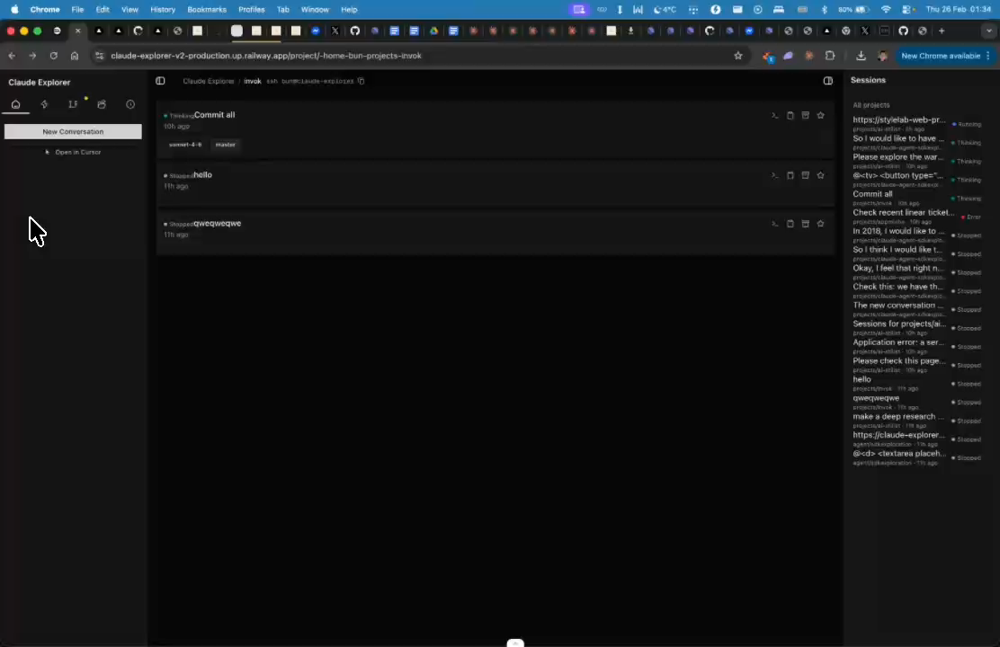
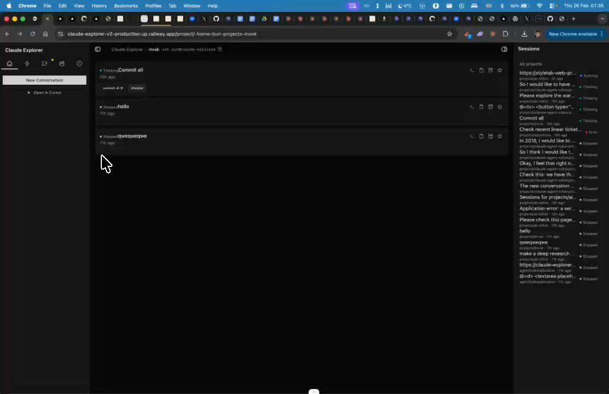

# Sidebar - Recent Activities & Work Trees

## Summary
Left sidebar could show recent activities. Research: if multiple git worktrees exist, can we map which session was used in which worktree?

## What's Being Shown
Left sidebar within project view could show contextual info

## Tasks
- [ ] Research: show recent activities in sidebar
- [ ] Research: if git worktrees exist, map which session was used in which worktree
- [ ] Display worktree info if available

## Screenshots
- 
- 

## Transcript Excerpt
```
[3:53.9] Okay, cool.
[3:56.3] Now on the left side bar.
[4:00.2] We could show.
[4:10.1] Some recent activities maybe.
[4:12.9] I'm not sure.
[4:18.1] Maybe if we have multiple gate work trees.
[4:24.2] But.
[4:26.3] Okay, this is for research.
```

## Timestamps
- Start: 233.9s (3:53.9)
- End: 268.2s (4:28.2)

## Implementation Plan

### Research Findings
- Sessions in SQLite have `project_path` (cwd) and `git_branch` — worktree mapping is natural since worktrees have unique filesystem paths
- `git worktree list --porcelain` gives structured output: path, HEAD, branch per worktree
- Worktree detection: compare `git rev-parse --git-dir` vs `--git-common-dir` — if different, it's a worktree

### Step 1: Add `getGitWorktrees()` to `lib/claude-fs.ts`
```ts
type GitWorktree = { path: string; head: string; branch: string; isMain: boolean; isCurrent: boolean; }
type GitWorktreeInfo = { hasWorktrees: boolean; isWorktree: boolean; mainRepoPath: string; worktrees: GitWorktree[]; }
```
Runs `git worktree list --porcelain`, parses output, resolves main repo path.

### Step 2: Add procedures to `lib/procedures.ts`
- `gitWorktreesProc` — input: `{ slug }`, output: `GitWorktreeInfo`
- `recentActivitiesProc` — input: `{ slug, limit? }`, output: last N sessions for project (reuses `getDbProjectSessions`)

### Step 3: Create `components/right-sidebar/recent-activities-section.tsx`
Shows last 5 sessions for current project with state badge, first prompt, time ago. Pattern: `ProjectAutomationsSection`.

### Step 4: Create `components/right-sidebar/worktree-info-section.tsx`
Shows worktrees with branch name, commit SHA, current indicator. Only renders if `hasWorktrees`. Returns null for non-git or single-worktree repos.

### Step 5: Integrate into `components/right-sidebar/overview-tab.tsx`
Add both sections between "Open in Cursor" and "Automations":
```tsx
<RecentActivitiesSection slug={slug} />
<WorktreeInfoSection slug={slug} />
```

### Session-to-Worktree Mapping
Session `project_path` == worktree `path` → session belongs to that worktree. Already handled by `getProjectSessions()` prefix matching.

### File Changes
| File | Action |
|------|--------|
| `lib/claude-fs.ts` | Add `getGitWorktrees()` |
| `lib/procedures.ts` | Add 2 procedures, register in router |
| `components/right-sidebar/recent-activities-section.tsx` | **NEW** |
| `components/right-sidebar/worktree-info-section.tsx` | **NEW** |
| `components/right-sidebar/overview-tab.tsx` | Mount both sections |

### Complexity: Low-Medium (2 new files, 3 modified)
