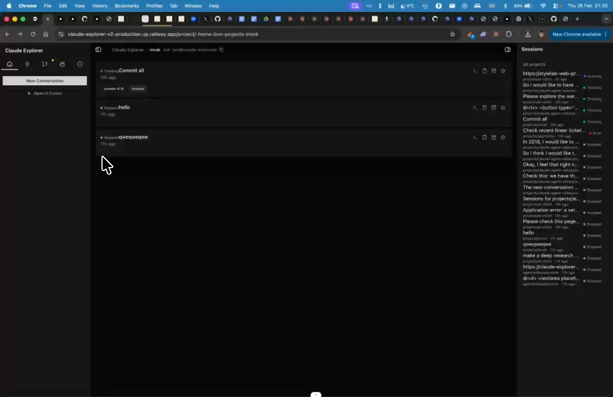

# Tmux Sessions Integration

## Summary
Display tmux sessions in the UI. Add a button to select a session and open it. Construct the tmux attach command automatically.

## What's Being Shown
Integrate tmux session management into the UI

## Tasks
- [ ] Display active tmux sessions in the UI
- [ ] Add button to select and open a tmux session
- [ ] Auto-construct tmux attach command
- [ ] Show tmux sessions from ~/.devs directory if applicable

## Screenshots
- 
- 

## Transcript Excerpt
```
[4:35.8] Also, we want to display the teamx sessions.
[4:40.5] If it's possible, the development is directory.
[4:57.2] So maybe.
[5:01.2] Some where I could have a button teamx.
[5:04.1] And I just select which session I want and I can open them.
[5:10.1] There is to be a code that construct that teamx command that let me connect.
[5:14.3] Maybe if some of this could be added somewhere here.
```

## Timestamps
- Start: 275.8s (4:35.8)
- End: 314.3s (5:14.3)

## Implementation Plan

### Existing Infrastructure
- `lib/tmux.ts` — `getTmuxPanes()` runs `tmux list-panes -a`, returns `TmuxPane[]`
- `lib/tmux-command.ts` — `generateTmuxCommand()` + `generateAttachCommand()` (supports SSH, CC mode)
- `lib/procedures.ts` — `tmux.panes` procedure exposed via oRPC
- `app/page.tsx` — `TmuxInCard` shows panes per project card
- `components/session-card.tsx` — tmux copy button per session
- `components/resume-session-popover.tsx` — tmux -CC and SSH+CC options

### What's Missing
1. No `tmux list-sessions` — only `list-panes` exists
2. No dedicated UI to browse ALL tmux sessions
3. No one-click attach (only copy-to-clipboard pattern)
4. No `~/.devs` directory scanning

### Step 1: Add `getTmuxSessions()` to `lib/tmux.ts`
New function using `tmux list-sessions -F "#{session_name} #{session_windows} ..."`. Returns `TmuxSession[]` with name, windows, created, attached status, cwd, projectSlug.

### Step 2: Add `~/.devs` filtering
Filter tmux sessions whose cwd starts with `~/.devs` (or `DEVS_DIR` env var). No separate command — filter on `getTmuxSessions()` results.

### Step 3: Register `tmux.sessions` procedure in `lib/procedures.ts`

### Step 4: Create `components/tmux-sessions-panel.tsx`
Reusable component showing all tmux sessions:
- Green/gray dot (attached vs detached)
- Session name, window count, last activity
- `CopyButton` with `generateAttachCommand()`
- 15s refetch interval
- Optional `projectSlug` prop for filtering

### Step 5: Add Tmux section to `components/right-sidebar/overview-tab.tsx`
`ProjectTmuxSection` — shows project-scoped tmux sessions. Returns null if none.

### Step 6: Add "Tmux" to `GLOBAL_NAV` in `project-sidebar.tsx`

### Step 7: Create `app/tmux/page.tsx`
Full-page view with unfiltered `TmuxSessionsPanel`.

### File Changes
| File | Action |
|------|--------|
| `lib/schemas.ts` | Add `TmuxSessionSchema` |
| `lib/tmux.ts` | Add `getTmuxSessions()` |
| `lib/procedures.ts` | Add `tmuxSessionsProc` |
| `components/tmux-sessions-panel.tsx` | **NEW** |
| `components/right-sidebar/overview-tab.tsx` | Add tmux section |
| `components/project-sidebar.tsx` | Add to `GLOBAL_NAV` |
| `app/tmux/page.tsx` | **NEW** |

### Complexity: Medium
