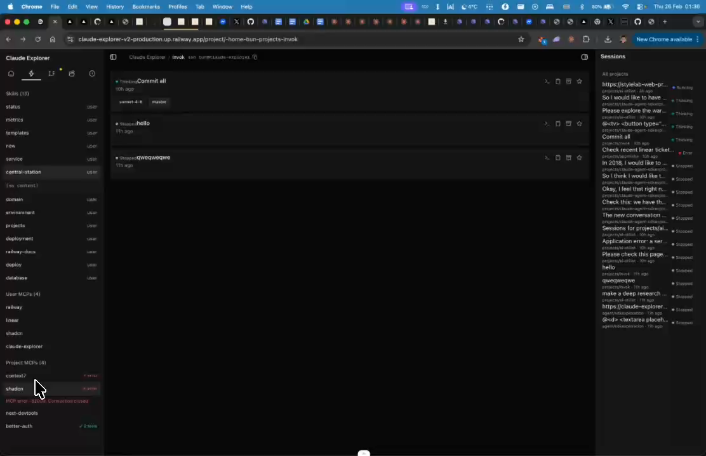
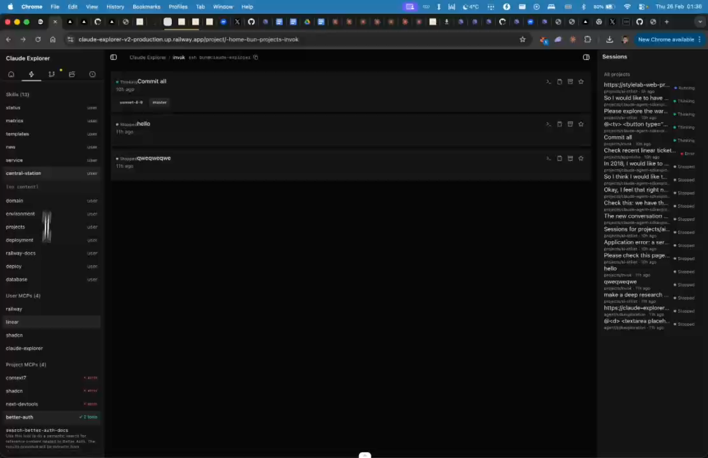

# Skills & MCP Status Display

## Summary
Skills section currently not working. MCP errors should be closeable. Tools display needs fixing. MCP listing works but needs polish.

## What's Being Shown
Skills and MCP server status display needs fixes

## Tasks
- [ ] Fix: Skills section currently not working/loading
- [ ] Fix: MCP errors should be dismissible (closeable)
- [ ] Fix: Tool display alongside MCP servers
- [ ] MCP listing works — needs polish and error handling

## Screenshots
- 
- 

## Transcript Excerpt
```
[5:24.8] Skill, MCP stops.
[5:28.1] It's currently.
[5:31.0] Skill, so not working.
[5:32.5] I think MCP error can actually close.
[5:35.2] For sure, it's in code X7.
[5:37.5] Next to the tool, so as well.
[5:39.0] The method of this actually works.
[5:43.2] Yeah.
[5:48.4] Nice to get the MCP.
```

## Timestamps
- Start: 324.8s (5:24.8)
- End: 349.7s (5:49.7)

## Implementation Plan

### 4 Sub-tasks (ordered by impact)

#### Task 1: Make MCP errors dismissible (smallest, most impactful)
**File:** `components/right-sidebar/skills-mcps-tab.tsx`
- Wrap error display (lines 258-261) in flex container with close (X) and retry buttons
- `dismissMcpError` handler: set `expandedMcp` to null, clear from `mcpResults`
- `retryMcp` handler: clear error, re-trigger `handleMcpToggle`

#### Task 2: Fix skills section error handling
**File:** `components/right-sidebar/skills-mcps-tab.tsx`
- Destructure `isError`, `error` from both `useQuery` calls (lines 38-45)
- Add error display with retry button before skills list
- Distinguish "loading" vs "no skills" vs "error loading" states

#### Task 3: Show MCP server name on tool use in chat
**Files:** `tool-renderers/index.ts`, `tool-renderers/generic-tool.tsx`, `tool-use-block.tsx`
- Parse `mcp__Linear__get_issue` → `{ server: "Linear", tool: "get_issue" }`
- Pass `mcpServer` prop to renderer
- In `generic-tool.tsx`: display secondary badge `[Linear] get_issue`

#### Task 4: Polish MCP listing
**File:** `components/right-sidebar/skills-mcps-tab.tsx`
- Add colored dot indicators: gray (not inspected), green (success), red (error), pulsing (connecting)
- Persist tool count in collapsed state (not just when expanded)
- Scrollable container for long error messages
- Optional: auto-inspect on tab mount with staggered probing

### File Changes
| File | Change |
|------|--------|
| `components/right-sidebar/skills-mcps-tab.tsx` | Tasks 1, 2, 4 |
| `components/tool-renderers/index.ts` | Task 3 — MCP name parsing |
| `components/tool-renderers/generic-tool.tsx` | Task 3 — server badge |
| `components/tool-use-block.tsx` | Task 3 — pass mcpServer prop |

### Complexity: Medium
