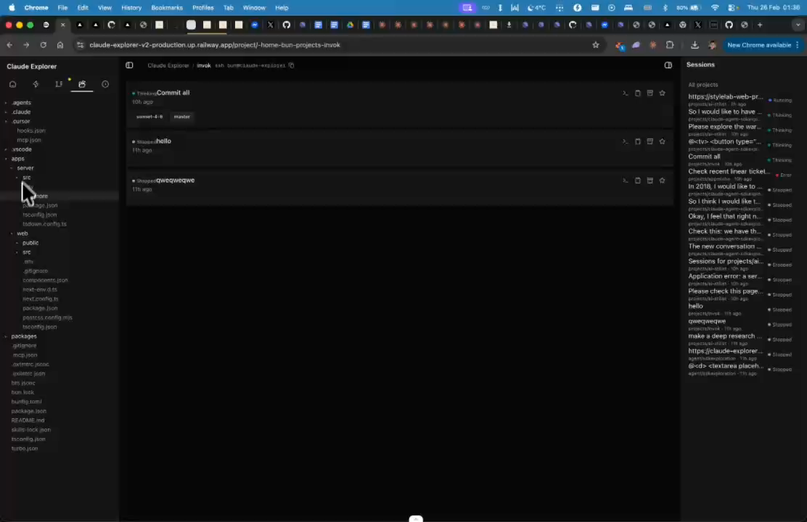
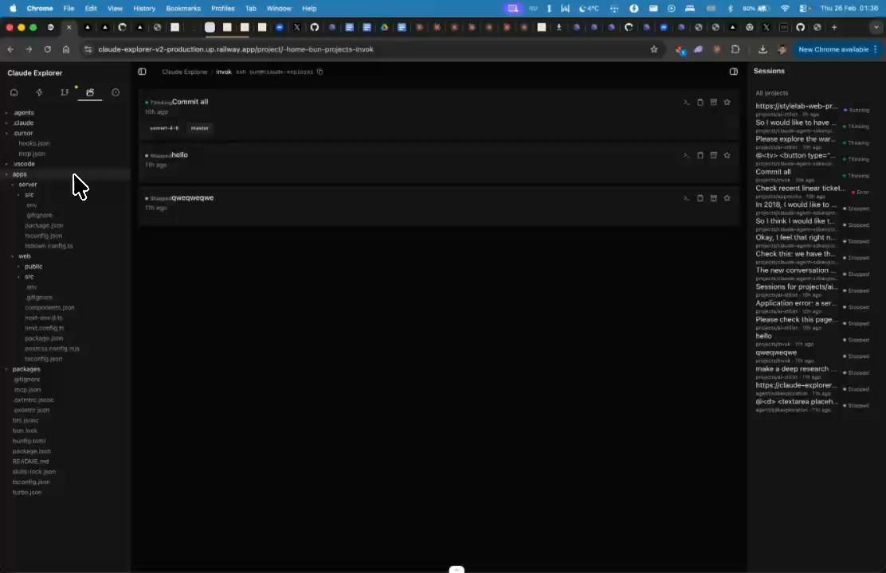

# File Tree - Open Files & Rich View

## Summary
File tree should allow opening a file to see its contents. Want a richer view with icons based on file type.

## What's Being Shown
File tree is too basic, needs richer interaction

## Tasks
- [ ] Allow clicking a file to open and view its contents
- [ ] Add file type icons to the tree (based on extension)
- [ ] Richer file tree view overall

## Screenshots
- 
- 

## Transcript Excerpt
```
[5:57.4] The file tree I want to be able to open a file and see it contents.
[6:04.2] Have like a more rich view of the file tree.
[6:08.5] Maybe with some icons based on the file type.
```

## Timestamps
- Start: 357.4s (5:57.4)
- End: 371.5s (6:11.5)

## Implementation Plan

### Current State
- File tree: `components/right-sidebar/file-tree-tab.tsx` — recursive `FileNode` component
- Dirs expand/collapse, files are listed but clicking does nothing
- No icons — just unicode arrows
- Backend: `readFileContent()` in `claude-fs.ts` (100KB cap) + `orpc.projects.readFile` procedure already exist
- `FilePreviewPopover` component already loads file content
- Icon library: **HugeIcons** (`@hugeicons/core-free-icons` + `@hugeicons/react`)

### Step 1: Create `components/right-sidebar/file-type-icon.tsx`
Extension-to-HugeIcon mapping:
- `.ts/.tsx/.js/.jsx` → `JavaScriptIcon` (blue)
- `.py` → `PythonIcon` (yellow)
- `.css` → `CssFile01Icon` (purple)
- `.html` → `GlobeIcon`
- `.json` → `CodeIcon`
- `.md` → `TextIcon`
- Images → `Image01Icon`, etc.
- Dirs: `Folder01Icon` / `FolderOpenIcon`

Exports: `getFileIcon(name, isDirectory, isExpanded) → { icon, colorClass }`

### Step 2: Replace unicode arrows with HugeIcons in `FileNode`
Replace `<span>▾/▸</span>` with `<HugeiconsIcon icon={getFileIcon(...)} size={13} />`

### Step 3: Add file size display
`listDirectory` API already returns `size` — show it as muted label on right side of file rows. Add `formatSize()` helper.

### Step 4: Make files clickable for content preview
- Add `selectedFile` state to `FileTreeTab`
- Pass `onFileClick` callback to `FileNode`
- Below tree: render inline preview panel with `orpc.projects.readFile` query
- Show first 50 lines with line numbers, close button, "Full view" link
- Pattern: reuse `FilePreviewPopover` query/display logic

### Step 5: Add file filter input
Small search input at top of tree. Filter `rootEntries` and `children` by `name.includes(filter)`. Auto-expand matching paths.

### Step 6: Polish
- Increase row height `py-0.5` → `py-1`
- Better hover highlight
- Detect binary files by extension → show "Binary file" instead of garbled content

### File Changes
| File | Action |
|------|--------|
| `components/right-sidebar/file-type-icon.tsx` | **NEW** |
| `components/right-sidebar/file-tree-tab.tsx` | Modify (icons, click, preview, filter, size) |

### Complexity: Low-Medium
