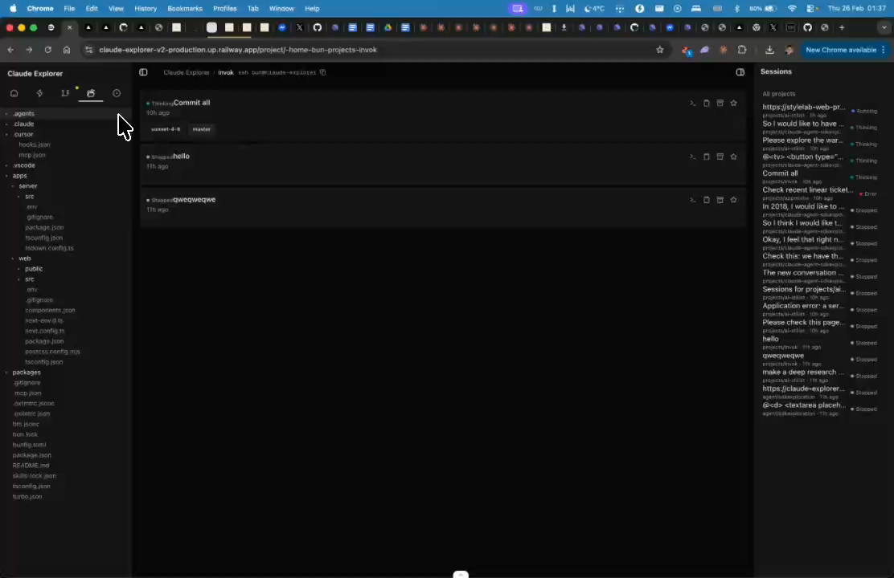
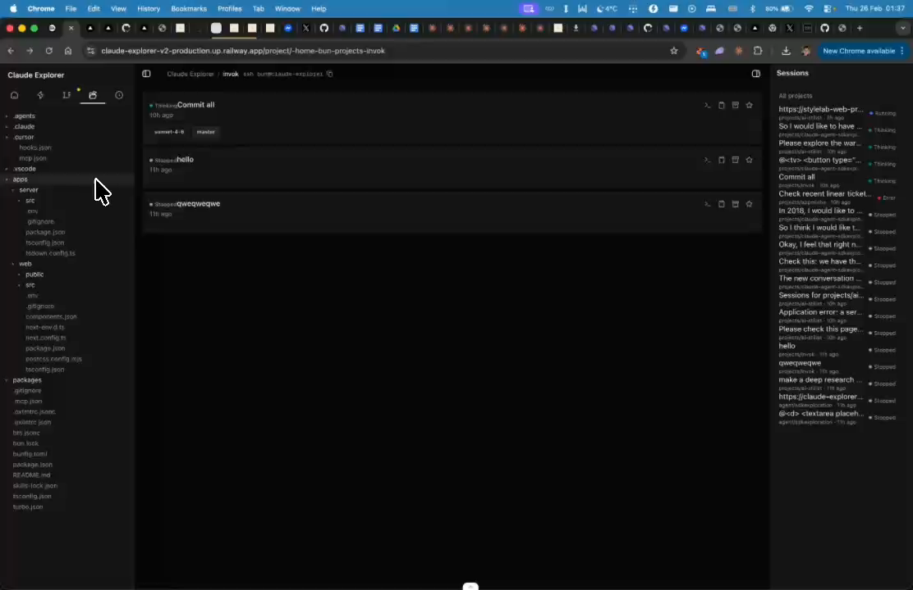

# Tab Interface - Multiple Open Tabs

## Summary
Add a tab interface to have multiple open tabs. Tabs should persist when navigating between projects.

## What's Being Shown
No tab interface exists for working with multiple views

## Tasks
- [ ] Implement tab interface for multiple open panels/files
- [ ] Tabs should persist when switching between projects
- [ ] Tab state should be saved/restored

## Screenshots
- 
- 

## Transcript Excerpt
```
[6:27.8] Yeah, definitely want to add tab to interface to be able to have open multiple tabs.
[6:32.7] So that I think this should be the persistence.
[6:38.6] If I go from project to project, open tab should persist.
```

## Timestamps
- Start: 387.8s (6:27.8)
- End: 402.6s (6:42.6)

## Implementation Plan

### Current Tab System (session-only)
- `components/agent-tabs/tab-context.tsx` — `TabState = { openTabs: string[], pinnedTabs: string[] }` (session IDs only), localStorage `"agent-tabs"`, Cmd+J toggle
- `agent-tab-bar.tsx` — queries `liveState.active`, auto-adds active sessions, tabs vanish when session ends
- `agent-tab-item.tsx` — requires `LiveSession` object, links to session URLs
- Only shows tabs with matching live session data

### Limitations
1. Session-only — can't tab to project pages, analytics, settings
2. Ephemeral — historical/ended sessions disappear
3. Not project-scoped — single global list
4. No metadata stored — only session IDs

### New `Tab` Type
```ts
type Tab = {
  id: string; url: string; title: string;
  type: "session" | "project" | "page";
  sessionId?: string; projectSlug?: string; pinned: boolean;
};
type TabState = { tabs: Tab[]; activeTabId: string | null; };
```

### Step 1: Redesign `tab-context.tsx`
- New `Tab` type with URL + metadata
- Migration from old `openTabs: string[]` format
- Auto-add tabs on pathname change (derive `title`/`type` from URL pattern)
- Static `PAGE_TITLES` map for `/analytics`, `/keys`, etc.
- `openTab()`, `closeTab()`, `pinTab()`, `findTabByUrl()`, `findTabBySessionId()`

### Step 2: Rewrite `agent-tab-bar.tsx`
- Render from `tabs[]` directly, not filtered through `sessionMap`
- Pinned tabs first, then unpinned
- Show whenever tabs exist (not just when live sessions exist)

### Step 3: Rewrite `agent-tab-item.tsx`
Accept `Tab` instead of `LiveSession`:
- Session type: state badge + first prompt
- Project type: folder icon + name
- Page type: page label

### Step 4: Update `agent-tab-mobile.tsx`
Same generalization for mobile bottom sheet.

### Step 5: Keyboard shortcuts
- `Cmd+W` close active tab
- `Ctrl+Tab` / `Ctrl+Shift+Tab` cycle tabs

### File Changes
| File | Action |
|------|--------|
| `components/agent-tabs/tab-context.tsx` | **Major rewrite** |
| `components/agent-tabs/agent-tab-bar.tsx` | **Rewrite** |
| `components/agent-tabs/agent-tab-item.tsx` | **Rewrite** |
| `components/agent-tabs/agent-tab-mobile.tsx` | **Rewrite** |

### Edge Cases
- Dedup tabs by URL (normalize trailing slashes)
- Session accessible via `/chat/{id}` or `/project/{slug}/chat/{id}` — secondary check by `sessionId`
- Placeholder title until first prompt arrives — reactive update via effect

### Complexity: High
