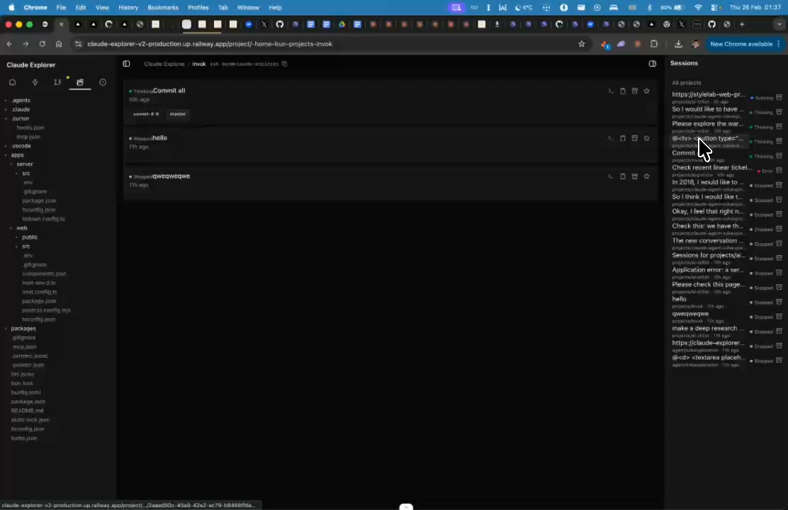

# Project-Scoped Sessions

## Summary
When inside a project, only show sessions for that project — not all sessions from the whole system.

## What's Being Shown
Sessions panel shows all system sessions, not filtered by project

## Tasks
- [ ] Filter sessions to only show those belonging to current project
- [ ] Keep 'all sessions' view accessible elsewhere

## Screenshots
- 

## Transcript Excerpt
```
[6:47.1] On the sessions on the right, once I'm in the project, I want to see the recent sessions just of this project.
[6:54.9] Not of the whole system.
```

## Timestamps
- Start: 407.1s (6:47.1)
- End: 417.5s (6:57.5)

## Implementation Plan

### Current Architecture
- `sessions.timeline` → `getDbAllRecentSessions(limit)` — returns ALL non-archived sessions
- `sessions.list` → `getDbProjectSessions(projectPath)` — already filters by `project_path` (used by main content `SessionList`)
- Right sidebar: always shows ALL sessions via `sessions.timeline`, labeled "All projects"
- `SessionsPanel` has `filterSlug` prop for client-side filtering — but nobody passes it
- `getDbProjectSessions()` already does server-side path prefix matching

### Step 1: Add optional `slug` to `sessions.timeline` in `lib/procedures.ts`
```ts
.input(z.object({ limit: z.number().optional(), slug: z.string().optional() }))
```
When `slug` provided → call `getDbProjectSessions()`. Otherwise → `getDbAllRecentSessions()`.

### Step 2: Update `SessionsPanel` in `components/sessions-panel.tsx`
Pass `slug` to the query when `filterSlug` is provided:
```ts
orpc.sessions.timeline.queryOptions({ input: { limit: 50, slug: filterSlug } })
```
Remove client-side `filteredSessions` filter.

### Step 3: Update `components/right-sidebar.tsx`
- Pass `filterSlug={activeSlug}` to `SessionsPanel` by default
- Add "This project / All projects" toggle button in sidebar header
- `showProjectLabel={false}` when filtering by project (redundant labels)

### No Changes Needed
- Left sidebar (`project-sidebar.tsx`) — root view correctly shows all sessions
- `SessionList` (main content) — already uses `sessions.list` with project slug
- `explorer-db.ts` — `getProjectSessions()` already has the right query

### Edge Cases
- Sessions without `project_path`: excluded from project filter (correct)
- Subdirectory sessions: included via prefix matching (correct)
- Query cache: React Query auto-caches separately by input key

### Complexity: Low (infrastructure 90% exists)
