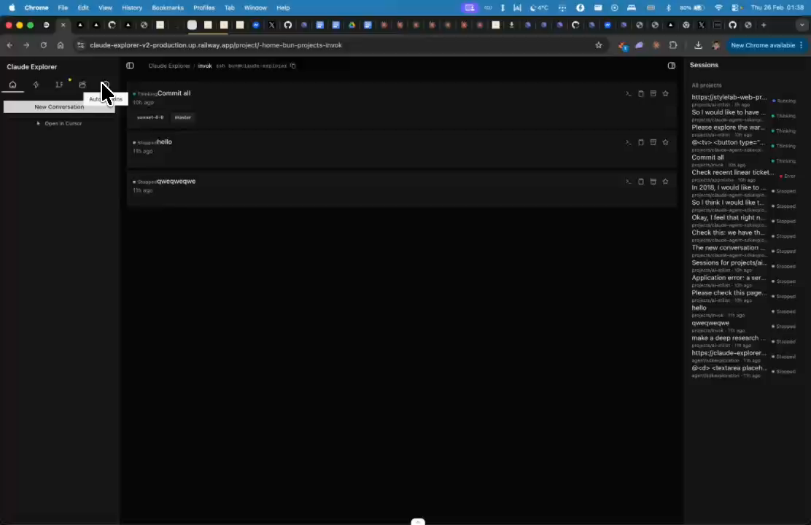
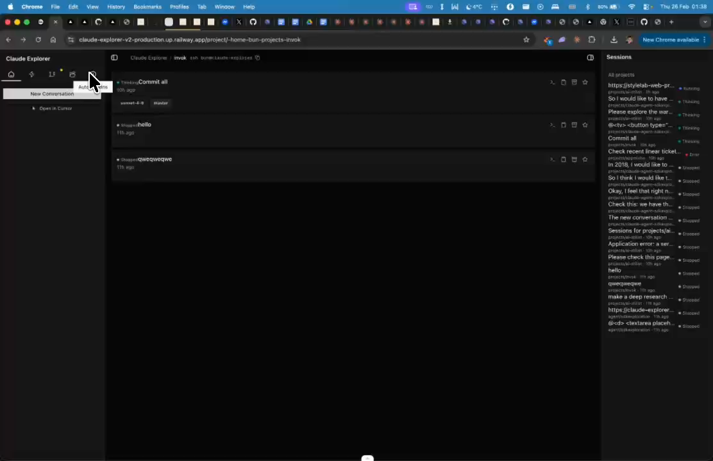

# Railway & Linear Integration

## Summary
Show Railway deployment info and Linear tickets in project view. Connect Linear project, see deployments and failures. Start a Claude session from a Linear ticket ('work on this ticket') or investigate a failed Railway deployment.

## What's Being Shown
No integration with Railway (deployments) or Linear (tickets)

## Tasks
- [ ] Add Railway integration — show deployment status, failures
- [ ] Add Linear integration — show project tickets
- [ ] Allow connecting a Linear project to the app project
- [ ] Allow starting a Claude session from a Linear ticket ('work on this ticket')
- [ ] Allow investigating a failed Railway deployment from the UI
- [ ] Show connected integrations in project view

## Screenshots
- 
- 
- 

## Transcript Excerpt
```
[7:07.0] Also, I want to see railway information that I've always connected and linear information.
[7:16.9] All the tickets.
[7:19.6] Actually, for linear, I want to be able to, for railway and linear, we want to have all the integration and you're able to select a project and linear and connect it and see deployments, if it fails.
[7:40.5] And you want to have it in a way where there is a linear ticket, I should be able to say to start a session and say, okay, cloud work on this ticket for example.
[8:04.6] Or in the railway, there is a fair deployment, maybe I could say, any investigator this, and so on and so on. So how does she look this?
[8:19.8] That's all for now.
```

## Timestamps
- Start: 427.0s (7:07.0)
- End: 500.7s (8:20.7)

## Implementation Plan

### Already Built (extensive infrastructure)
- `lib/integration-providers/railway.ts` — full GraphQL client, `testConnection()`, `fetchWidgets()` with services + deploys
- `lib/integration-providers/linear.ts` — full Linear SDK client, issues + activity widgets
- `components/project-integrations.tsx` — add/configure/display integrations UI
- `lib/linear-agent.ts` — bot-auth Linear client with agent session support
- `lib/webhook-executor.ts` — fires Claude sessions from webhook events
- `lib/webhook-event-catalog.ts` — Railway + Linear events catalogued
- `components/right-sidebar/overview-tab.tsx` — integrations section in sidebar

### What's Missing (the actual feature)
1. "Work on this" button on Linear issue widget items → starts Claude session with ticket context
2. "Investigate" button on failed Railway deploys → starts session with failure context
3. Auto-send prompt mechanism from URL

### Step 1: Extend `WidgetItemSchema` in `lib/schemas.ts`
Add optional `action` field:
```ts
action: z.object({
  label: z.string(),
  type: z.enum(["start_session"]),
  prompt: z.string(),
}).optional()
```

### Step 2: Add action to Linear issue items in `lib/integration-providers/linear.ts`
```ts
action: { label: "Work on this", type: "start_session",
  prompt: `Work on Linear ticket ${i.identifier}: ${i.title}\n\nURL: ${i.url}\n\nDescription:\n${i.description ?? "(none)"}` }
```
Also fetch `i.description` (not currently fetched).

### Step 3: Add action to failed Railway deploys in `lib/integration-providers/railway.ts`
Only for `FAILED`/`CRASHED` status:
```ts
action: { label: "Investigate", type: "start_session",
  prompt: `Investigate failed Railway deployment.\nService: ${name}\nStatus: ${status}\nCommit: ${msg}\nBranch: ${branch}` }
```

### Step 4: Render action button in `components/project-integrations.tsx`
Add `slug` prop to `IntegrationWidgets`. Render button that navigates to `/project/{slug}/chat?prompt=<encoded>`.

### Step 5: Auto-send prompt in `app/project/[slug]/chat/page.tsx`
Read `?prompt=` query param, auto-send on mount via `useRef` guard.

### Step 6: Pass `slug` in `components/right-sidebar/overview-tab.tsx`

### File Changes
| File | Change |
|------|--------|
| `lib/schemas.ts` | Add `action` to `WidgetItemSchema` |
| `lib/integration-providers/linear.ts` | Add "Work on this" action + fetch description |
| `lib/integration-providers/railway.ts` | Add "Investigate" action on failed deploys |
| `components/project-integrations.tsx` | Render action button, accept `slug` |
| `components/right-sidebar/overview-tab.tsx` | Pass `slug` to widgets |
| `app/project/[slug]/chat/page.tsx` | Auto-send from `?prompt=` param |

### Complexity: Low-Medium (infrastructure fully built, just wiring)
